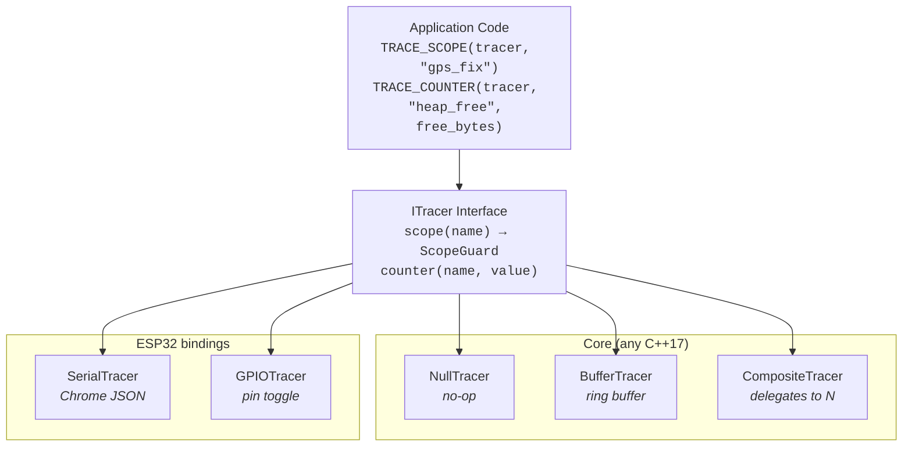

# embedded-trace — Design

A lightweight, hierarchical scope-tracing library for embedded systems.
Designed for ESP32/FreeRTOS as a first target, with a platform-agnostic core
that compiles on any C++17 host.

## Motivation

### The problem

Firmware observability requires knowing *what the system is doing* at every
moment. Answering questions like "how much power does a GPS fix consume?" or
"which operation is responsible for the heap high-water mark?" requires two
things: a structured record of what operations ran and when, and the ability
to attribute resource measurements to those operations.

The traditional approach — ad-hoc `printf` and GPIO toggles — doesn't scale
to multi-threaded systems with nested operations spanning multiple subsystems.
Each new measurement need (power profiling, memory tracking, data usage
analysis) produces another bespoke instrumentation pass with no shared
structure.

### The solution

embedded-trace provides a **scope tree** as the backbone of instrumentation.
Every significant operation is a named scope with RAII entry/exit tracking.
The scope tree is the single structure onto which multiple independent
**metric layers** (power, memory, timing, data usage) can be pinned — either
on-device or by external tools.

The scope tree answers *what is the system doing?* The metric layers answer
*what does it cost?* Keeping them separate means:
- The scope tree is always-on and near-zero cost (NullTracer in production)
- Metric layers are opt-in — enable power profiling on the bench, memory
  tracking when investigating a leak, data usage when optimizing cellular costs
- External measurement tools (PPK2 power profiler) align their data to the
  same scope boundaries without any firmware changes
- The same scopes serve multiple consumers: Perfetto visualization, PPK2
  channel encoding, on-device metric attribution, fleet-level analytics

### Why not use an existing tool?

We evaluated seven existing frameworks against the requirements of
resource-constrained embedded systems (ESP32 with ~300KB usable RAM):

| Tool | Assessment |
|------|-----------|
| **OpenTelemetry C++ SDK** | The span model (parent-child tree, attributes, linked metrics) is an exact match. But the SDK requires protobuf, gRPC/HTTP exporters, and heavy STL usage — ~100KB+ binary, far too large for a microcontroller. |
| **Perfetto native SDK** | Provides C++ RAII macros (`TRACE_EVENT`, `TRACE_COUNTER`) but targets Linux/Android/ChromeOS. Not ported to FreeRTOS/ESP-IDF. The *format* (Chrome JSON) is trivially easy to generate. |
| **barectf** | Generates pure ANSI C tracers from a YAML schema, ~1-3KB code. Excellent weight class but produces CTF (Common Trace Format) binary — flat events, no built-in parent-child hierarchy. Requires Babeltrace/Trace Compass for analysis, which is less ergonomic than Perfetto. |
| **Zephyr tracing / Zephelin** | Good reference architecture — ring buffer + post-hoc CTF-to-Chrome-JSON conversion. But it's Zephyr-specific (wrong RTOS) and kernel-focused (thread switches, mutex operations) rather than application-scoped. |
| **SEGGER SystemView** | Real-time FreeRTOS task/ISR tracing with a polished viewer. But the viewer is closed-source, events are flat (no hierarchical scopes), and there's no mechanism to import external data (like power measurements) for correlation. |
| **ESP-IDF app_trace** | JTAG-only high-speed trace to host. No scope concept, no hierarchy, not usable without a JTAG probe. The *APIs* it wraps (`esp_timer_get_time()`, heap hooks) are useful as metric sources within our scope tree. |
| **Tracy** | Feature-rich real-time profiler with RAII zones and memory tracking. Requires TCP streaming to a desktop viewer — impractical for battery-powered embedded devices. Significant binary size and RAM overhead. |

**Conclusion**: No existing tool provides hierarchical scoped tracing at
an appropriate weight class for embedded systems with Perfetto-compatible
output. The best approach is a custom library that combines:
- OpenTelemetry's **data model** (parent-child spans)
- barectf's **weight class** (~1-5KB code, no dynamic allocation in core)
- Perfetto's **output format** (Chrome JSON, directly visualizable)
- Zephyr tracing's **architecture** (ring buffer on device, conversion on host)

### Design influences

| Source | What we took |
|--------|-------------|
| **OpenTelemetry** | Span model — parent-child tree, attributes, linked metrics |
| **Perfetto** | Output format — Chrome Trace JSON, counter tracks, swim lanes per thread |
| **barectf** | Weight class — minimal generated code, small ring buffers, zero dynamic allocation |
| **Zephyr tracing / Zephelin** | Architecture — ring buffer on device, post-hoc conversion to Chrome JSON on host |

---

## Architecture



### Core (platform-agnostic)

Zero platform dependencies. Compiles on native host, ESP32, Zephyr,
bare-metal — anything with a C++17 compiler.

### ESP32 bindings

Depend on ESP-IDF (for `esp_timer_get_time()`, GPIO, FreeRTOS task ID).
Live in a separate source directory so the core compiles cleanly on native.

Future bindings (Zephyr, nRF, STM32) follow the same pattern — separate
source directory, same `ITracer` interface.

---

## Core API

### ITracer

```cpp
// embedded_trace/i_tracer.h

// All methods pure virtual. Every implementation makes a conscious
// choice about every event type — a forgotten override is a compile
// error, not a silently dropped event.
class ITracer {
public:
    virtual ~ITracer() = default;

    // scope() has a category field (Chrome "cat") via an optional second
    // arg. Two calling forms:
    //   scope("notecard", "verify")   — explicit (category, name)
    //   scope("notecard.verify")      — single arg, tracer auto-splits
    //                                   on first dot at render time
    virtual ScopeGuard scope(const char* cat_or_name,
                             const char* name = nullptr) = 0;

    virtual void counter(const char* name, int64_t value) = 0;

    virtual void flow_start(const char* name, FlowId id) = 0;
    virtual void flow_step(const char* name, FlowId id) = 0;
    virtual void flow_end(const char* name, FlowId id) = 0;

    virtual void set_process_name(const char* name) = 0;
    virtual void set_thread_name(ThreadId tid, const char* name) = 0;
};
```

#### Category handling

Perfetto uses Chrome's `cat` field for colour-coding and SQL filtering.
embedded-trace exposes it via the optional second arg on `scope()`:

```cpp
tracer.scope("notecard", "verify");   // explicit → cat="notecard" name="verify"
tracer.scope("notecard.verify");      // dotted  → cat="notecard" name="verify"
tracer.scope("plain");                // no dot  → cat=null     name="plain"
```

The split rule is shared between tracers via `split_scope_name()` in
`embedded_trace/name_split.h`. SerialTracer splits at JSON emit time;
BufferTracer stores pointers verbatim and exposes them on `DrainEvent`
unchanged (drain consumers that want the split call `split_scope_name()`
on the returned name).

Both `cat` and `name` pointers must be string literals — BufferTracer
interns by pointer equality on the `(cat, name)` pair.

`counter()` and `flow_*` remain single-arg for now; if category becomes
useful for those event types, the same pattern extends.

To avoid stubbing methods you don't care about, inherit from a narrow
named mixin instead of `ITracer` directly:

```cpp
// embedded_trace/no_flow_tracer.h
class NoFlowTracer : public ITracer {
    void flow_start(const char*, FlowId) override {}
    void flow_step(const char*, FlowId) override {}
    void flow_end(const char*, FlowId) override {}
    // scope, counter, metadata remain pure
};

// embedded_trace/no_metadata_tracer.h
class NoMetadataTracer : public ITracer {
    void set_process_name(const char*) override {}
    void set_thread_name(ThreadId, const char*) override {}
    // scope, counter, flow remain pure
};
```

Skipping a mixin is the signal that you're signing up to implement that
concern. The library does **not** ship a `BaseTracer`-style catch-all —
name by what you're opting out of.

In practice:
- **`ITracer`** — SerialTracer, CompositeTracer (both implement all seven).
- **`NoMetadataTracer`** — BufferTracer (real flow_*, no-op metadata).
- **`NoFlowTracer` + `NoMetadataTracer`** — a tracer that cares only
  about scope/counter. NullTracer implements all seven inline instead
  of chaining bases, as the canonical "do nothing" reference.

Metadata events are one-shot: emit `set_process_name` once at trace
start, and `set_thread_name(tid, "...")` once per task. Without them,
Perfetto labels lanes `process_1` / `thread_<task_handle>` — readable
but not informative. With them you get `simple_publish v0.10.1` /
`loopTask` / `NotecardIO`.

Implementations:
- **SerialTracer** — emits Chrome `ph:M` JSON.
- **NullTracer / BufferTracer** — no-op (default). BufferTracer has
  no host-side use case for buffered metadata yet.
- **CompositeTracer** — forwards to all children.

#### Scope name lifetime

Scope names passed to `ITracer::scope()` (and `TRACE_SCOPE`) MUST be
**string literals** — or some other pointer with program-long lifetime
and stable address.

BufferTracer interns names by pointer equality: the scope-enter event
stores a `ScopeId` into a fixed-size table (`MAX_SCOPE_NAMES = 64`), and
later drain() resolves the ID back to the pointer. If the pointer no
longer points at a valid string by drain time, the trace output is
garbage.

SerialTracer is lenient — it copies the pointed-at bytes into its JSON
line immediately and forgets the pointer. Code written against
SerialTracer with dynamic names (e.g. `std::string::c_str()`) **will
break** when a BufferTracer (or CompositeTracer with a BufferTracer
child) is added later. Keep names as literals.

### ScopeGuard

```cpp
// embedded_trace/scope_guard.h

class ScopeGuard {
public:
    /// Construct a scope guard. Records scope-enter.
    ScopeGuard(ITracer* tracer, const char* name, uint16_t scope_id);

    /// Destruct. Records scope-exit if tracer is non-null.
    ~ScopeGuard();

    /// End the scope eagerly. Fires the exit event once and disables the
    /// destructor. Safe to call repeatedly. Use before a no-return call
    /// (deep sleep, restart, abort) where the destructor would never run.
    void end() noexcept;

    // Move-only — scopes are not copyable.
    ScopeGuard(ScopeGuard&& o) noexcept;
    ScopeGuard& operator=(ScopeGuard&&) noexcept;
    ScopeGuard(const ScopeGuard&) = delete;
    ScopeGuard& operator=(const ScopeGuard&) = delete;

private:
    ITracer* tracer_;
    const char* name_;
    uint16_t scope_id_;
};
```

#### Scopes and no-return calls

`TRACE_SCOPE` relies on the destructor firing as the enclosing function
returns. Calls that never return — `esp_deep_sleep_start()`,
`esp_restart()`, `abort()` — skip stack unwinding, so any live scope
emits `B` with no matching `E`.

**Preferred:** structure code so no live `TRACE_SCOPE` spans the
no-return call. Pop back to a frame above the scope first:

```cpp
void run_wake_cycle() {
    TRACE_SCOPE(tracer, "wake_cycle");
    do_work();
}                                  // ← E emitted here

void main_loop() {
    run_wake_cycle();              // all scopes unwound
    esp_deep_sleep_start();        // safe — no live scopes
}
```

**Escape hatch:** when refactoring isn't practical, hold the guard
manually and call `end()` before the no-return:

```cpp
auto g = tracer.scope("wake_cycle");
shutdown();
g.end();                           // E emitted synchronously
esp_deep_sleep_start();
```

Note this drops the `TRACE_SCOPE` macro — the macro mangles the
variable name with `__LINE__` so the user can't reach `end()`. That's
intentional: it steers users toward RAII. Manual close is the
exception, not the norm.

### Macros

```cpp
// embedded_trace/trace_macros.h

#if EMBEDDED_TRACE_ENABLED
  #define TRACE_SCOPE(tracer, name) \
      auto ET_CONCAT(_et_scope_, __LINE__) = (tracer).scope(name)
  #define TRACE_COUNTER(tracer, name, val) \
      (tracer).counter(name, val)
  #define TRACE_FLOW_START(tracer, name, id) \
      (tracer).flow_start(name, id)
  #define TRACE_FLOW_STEP(tracer, name, id) \
      (tracer).flow_step(name, id)
  #define TRACE_FLOW_END(tracer, name, id) \
      (tracer).flow_end(name, id)
#else
  #define TRACE_SCOPE(tracer, name) ((void)0)
  #define TRACE_COUNTER(tracer, name, val) ((void)0)
  #define TRACE_FLOW_START(tracer, name, id) ((void)0)
  #define TRACE_FLOW_STEP(tracer, name, id) ((void)0)
  #define TRACE_FLOW_END(tracer, name, id) ((void)0)
#endif
```

When `EMBEDDED_TRACE_ENABLED` is 0 or undefined, all tracing compiles to
nothing — zero code size, zero RAM, zero CPU.

---

## Tracer Implementations

### NullTracer

```cpp
// embedded_trace/null_tracer.h

class NullTracer final : public ITracer {
public:
    static NullTracer& instance();

    ScopeGuard scope(const char* name) override {
        return ScopeGuard(nullptr, name, 0);  // no-op guard
    }

    void counter(const char*, int64_t) override {}
};
```

Production default. `ScopeGuard` with null tracer pointer — destructor is a
no-op branch. The compiler can often eliminate the guard entirely.

### BufferTracer

Platform-agnostic binary ring buffer tracer. The timestamp source is injected
so it works on any platform. Stores events in a compact binary format for
post-hoc capture where serial output would perturb timing.

```cpp
// embedded_trace/buffer_tracer.h

class BufferTracer final : public ITracer {
public:
    static constexpr size_t MAX_SCOPE_NAMES = 64;

    /// Construct with a caller-provided buffer and timestamp function.
    /// The buffer is NOT owned — caller manages its lifetime.
    BufferTracer(uint8_t* buffer, size_t size, TimestampFn timestamp_fn);

    ScopeGuard scope(const char* name) override;
    void counter(const char* name, int64_t value) override;
    void flow_start(const char* name, FlowId id) override;
    void flow_step(const char* name, FlowId id) override;
    void flow_end(const char* name, FlowId id) override;

    /// Drain the buffer, calling the visitor for each stored event.
    void drain(DrainCallback callback, void* context) const;

    size_t event_count() const;
    bool overflowed() const;
    void reset();
};
```

#### Binary event format

| Field | Size | Description |
|-------|------|-------------|
| `timestamp_us` | 4 bytes | From `TimestampFn`, truncated to uint32 (~71 min before wrap — see [Timestamp wrap](#timestamp-wrap)) |
| `scope_id` | 2 bytes | Auto-assigned ID for each unique scope name |
| `event_type` | 1 byte | 0=scope_enter, 1=scope_exit, 2=counter, 3-5=flow events |
| `payload` | 0-8 bytes | Counter value (type=2, 8B) or FlowId (type=3-5, 2B) |

~7-15 bytes per event. An 8KB buffer holds ~500-1000 events.

The scope ID → name mapping is maintained as a compact table (array of
`const char*` pointers, up to 64 entries). Scope names must be string
literals (pointer stability guaranteed). The mapping is used at drain
time to resolve scope IDs back to names.

### SerialTracer (ESP32)

```cpp
// embedded_trace_esp32/serial_tracer.h

class SerialTracer final : public ITracer {
public:
    /// Construct with a Print output (e.g. Serial).
    /// @param output       Print stream (e.g. Serial)
    /// @param timestamp_fn Microsecond timestamp source
    /// @param pid          Process ID for Chrome JSON (default 1)
    /// @param tid_fn       Thread ID function. When null, defaults to
    ///                     et::esp_idf_tid_fn on ESP-IDF (one Perfetto lane
    ///                     per FreeRTOS task) or constant 1 elsewhere.
    SerialTracer(Print& output, TimestampFn timestamp_fn,
                 ProcessId pid = 1, ThreadIdFn tid_fn = nullptr);

    ScopeGuard scope(const char* name) override;
    void counter(const char* name, int64_t value) override;
    void flow_start(const char* name, FlowId id) override;
    void flow_step(const char* name, FlowId id) override;
    void flow_end(const char* name, FlowId id) override;
};
```

Emits one Chrome JSON event per line:

```json
{"ph":"M","name":"process_name","pid":1,"args":{"name":"simple_publish"}}
{"ph":"M","name":"thread_name","pid":1,"tid":2,"args":{"name":"loopTask"}}
{"ph":"B","ts":1234,"name":"gps_fix","pid":1,"tid":2}
{"ph":"E","ts":5678,"name":"gps_fix","pid":1,"tid":2}
{"ph":"C","ts":5678,"name":"heap","pid":1,"tid":2,"args":{"value":102400}}
{"ph":"s","ts":1001,"name":"notecard_req","id":42,"pid":1,"tid":2}
{"ph":"f","ts":1200,"name":"notecard_req","id":42,"pid":1,"tid":1}
```

- `ts` — microseconds from the injected timestamp function
- `pid` — process ID (1 by default, configurable for grouping)
- `tid` — from the injected thread ID function. On ESP-IDF defaults to
  `et::esp_idf_tid_fn` (FreeRTOS task handle → one Perfetto lane per task);
  elsewhere defaults to constant 1. Pass a custom `ThreadIdFn` to override.
- `ph:"B"` / `"E"` — scope begin/end
- `ph:"C"` — counter sample
- `ph:"s"` / `"t"` / `"f"` — flow start/step/end (cross-thread causal links)
- `ph:"M"` — metadata (process_name, thread_name) — one-shot at trace start

Output is directly loadable in [Perfetto UI](https://ui.perfetto.dev) when
wrapped in `{"traceEvents":[...]}` by the host collector. Host-side consumers
(embedded-bridge EventCapture, ppk2-python EventMapper) parse these same
Chrome JSON lines directly.

#### Timestamp wrap

`TimestampUs` is `uint32_t` microseconds from an arbitrary epoch. It wraps
every **2³² µs ≈ 71.58 minutes** of continuous tracer activity.

The library is deliberately wrap-unaware on the device:

- **SerialTracer** emits `ts` straight into JSON, no comparison.
- **BufferTracer** stores raw 4-byte `ts` and reads it back on drain.
- No `last_ts_` / wrap counter anywhere — every event is self-contained.

Rationale: on-device wrap detection would cost a branch and shared state
per event (race-prone across tasks) without fixing anything the host
can't fix more robustly.

**Host-side consumers are responsible for wrap detection.** The algorithm
is trivial — if `ts[i] < ts[i-1]` during the same tracer session, add 2³²
to all subsequent timestamps:

```python
wrap_count = 0
prev_raw = 0
for event in events:
    raw = event["ts"]
    if raw < prev_raw:
        wrap_count += 1
    prev_raw = raw
    event["ts"] = raw + wrap_count * (1 << 32)
```

Perfetto requires monotonically increasing `ts`; without this fix,
post-wrap events appear at the start of the timeline.

**Downstream consumers that must implement this:**

- `embedded-bridge` / `EventCapture` — Chrome JSON line parser.
- `ppk2-python` / `EventMapper` — scope-to-PPK2-channel mapper.

If/when a 64-bit `TimestampUs` build flag lands, these consumers will
need to detect the chosen width (likely by a marker in the trace stream,
e.g. first `M` metadata event) and skip the wrap compensation when
timestamps are already monotonic.

### GPIOTracer (ESP32)

```cpp
// embedded_trace_esp32/gpio_tracer.h

struct GPIOScopeMapping {
    const char* name;   // scope name to match
    gpio_num_t pin;     // GPIO pin to toggle
};

class GPIOTracer final : public ITracer {
public:
    /// Construct with a mapping of scope names to GPIO pins.
    /// Pins are configured as outputs during construction.
    GPIOTracer(const GPIOScopeMapping* mappings, size_t count);

    ScopeGuard scope(const char* name) override;
    void counter(const char*, int64_t) override {}  // no-op for GPIO
};
```

Toggles mapped GPIO pins HIGH on scope enter, LOW on scope exit.
~1µs per event. Unmapped scopes are ignored (no GPIO overhead).

Designed for PPK2 digital inputs (D0-D7). The PPK2 records these as
logical channels alongside current measurements, providing sub-microsecond
alignment between scope boundaries and power data.

### CompositeTracer

```cpp
// embedded_trace/composite_tracer.h

class CompositeTracer final : public ITracer {
public:
    static constexpr size_t MAX_CHILDREN = 4;

    /// Construct with an array of child tracers.
    CompositeTracer(ITracer** tracers, size_t count);

    ScopeGuard scope(const char* name) override;
    void counter(const char* name, int64_t value) override;
    void flow_start(const char* name, FlowId id) override;
    void flow_step(const char* name, FlowId id) override;
    void flow_end(const char* name, FlowId id) override;
};
```

Delegates all operations to all children. Manages child ScopeGuards
internally — each `scope()` call stores up to `MAX_CHILDREN` child
guards on an internal stack (up to 8 levels of nesting).

Typical use: `SerialTracer` for real-time output + `BufferTracer` for
high-precision post-hoc capture.

---

## Chrome Trace Format Reference

embedded-trace targets the
[Chrome JSON Trace Format](https://docs.google.com/document/d/1CvAClvFfyA5R-PhYUmn5OOQtYMH4h6I0nSsKchNAySU/preview)
for output. This format is natively supported by
[Perfetto UI](https://ui.perfetto.dev) and `chrome://tracing`.

### Event types used

| `ph` | Type | Usage |
|------|------|-------|
| `B` | Begin | Scope enter — marks the start of a duration event |
| `E` | End | Scope exit — marks the end of a duration event |
| `C` | Counter | Counter sample — renders as a time-series graph track |
| `X` | Complete | Duration event with explicit `dur` field (used by BufferTracer drain, more compact than B+E) |
| `M` | Metadata | Process/thread naming (emitted once at trace start) |

### Example trace file

```json
{"traceEvents": [
  {"ph":"M","pid":1,"tid":1,"name":"process_name","args":{"name":"firmware"}},
  {"ph":"M","pid":1,"tid":1,"name":"thread_name","args":{"name":"main"}},
  {"ph":"M","pid":1,"tid":2,"name":"thread_name","args":{"name":"gps_task"}},
  {"ph":"B","ts":1000,"pid":1,"tid":1,"name":"wake_cycle"},
  {"ph":"B","ts":1100,"pid":1,"tid":1,"name":"init"},
  {"ph":"E","ts":1500,"pid":1,"tid":1,"name":"init"},
  {"ph":"B","ts":1600,"pid":1,"tid":2,"name":"gps_fix"},
  {"ph":"C","ts":1600,"pid":1,"tid":0,"name":"heap_free","args":{"value":142000}},
  {"ph":"E","ts":4200,"pid":1,"tid":2,"name":"gps_fix"},
  {"ph":"C","ts":4200,"pid":1,"tid":0,"name":"heap_free","args":{"value":138000}},
  {"ph":"E","ts":5000,"pid":1,"tid":1,"name":"wake_cycle"}
]}
```

Opens in Perfetto with:
- Two swim lanes (main task + gps_task)
- Nested scope bars (wake_cycle contains init, gps_fix runs on its own task)
- `heap_free` counter graph track below the swim lanes

---

## Serial Protocol

### Chrome JSON mode (SerialTracer)

One JSON object per line on serial output. The host collector
(embedded-host or any line-based serial reader) collects lines matching
`{"ph":...}` and wraps them:

```json
{"traceEvents": [<collected lines>]}
```

Lines not matching the JSON pattern are passed through as regular serial
output (log messages, test results, etc.). This means tracing and regular
`Serial.println()` coexist on the same port.

### Binary drain mode (BufferTracer)

When the host requests a buffer drain (via command protocol), the firmware
sends:

1. **Header** — magic bytes, event count, scope name table
2. **Events** — packed binary events (7-15 bytes each)
3. **Footer** — checksum

The host converts this to Chrome JSON. The binary protocol is defined in
`buffer_tracer.h` and documented separately once implemented.

### Host-side consumers

The Chrome JSON output serves multiple host-side consumers from the same
serial stream:

- **Perfetto UI** — wrap lines in `{"traceEvents":[...]}` for visualization
- **embedded-bridge EventCapture** — parses `ph:"B"/"E"` lines into spans
- **ppk2-python EventMapper** — maps scope events to PPK2 digital channels

---

## Project Structure

```
embedded-trace/
├── library.json                    # PlatformIO library metadata
├── platformio.ini                  # native + esp32s3 build/test environments
├── LICENSE
├── README.md
├── docs/
│   └── design.md                   # this file
├── src/
│   ├── embedded_trace/            # core (platform-agnostic, C++17)
│   │   ├── i_tracer.h
│   │   ├── scope_guard.h
│   │   ├── scope_guard.cpp
│   │   ├── null_tracer.h
│   │   ├── buffer_tracer.h
│   │   ├── buffer_tracer.cpp
│   │   ├── composite_tracer.h
│   │   ├── composite_tracer.cpp
│   │   └── trace_macros.h
│   └── embedded_trace_esp32/      # ESP32 bindings
│       ├── serial_tracer.h
│       ├── serial_tracer.cpp
│       ├── gpio_tracer.h
│       └── gpio_tracer.cpp
├── test/
│   ├── test_native/                # doctest, runs on host
│   │   ├── main.cpp                # doctest main
│   │   ├── test_scope_guard.cpp
│   │   ├── test_buffer_tracer.cpp
│   │   ├── test_composite_tracer.cpp
│   │   └── test_chrome_json.cpp    # validate JSON output format
│   └── test_esp32s3/               # doctest, runs on hardware
│       ├── main.cpp
│       ├── test_serial_tracer.cpp
│       └── test_gpio_tracer.cpp
└── examples/
    ├── basic_scopes/               # minimal: scope nesting, print to serial
    │   └── main.cpp
    └── esp32_perfetto/             # full: ESP32 → serial → Perfetto
        └── main.cpp
```

### PlatformIO environments

| Environment | Platform | What it builds/tests |
|------------|----------|---------------------|
| `native` | Host (macOS/Linux) | Core library + native doctests |
| `esp32s3` | ESP32-S3 | Full library (core + ESP32 bindings) + embedded doctests |

### library.json

```json
{
    "name": "embedded-trace",
    "version": "0.1.0",
    "description": "Lightweight hierarchical scope tracing for embedded systems with Perfetto output",
    "keywords": ["tracer", "profiling", "perfetto", "instrumentation", "embedded", "esp32"],
    "platforms": ["native", "espressif32"],
    "frameworks": ["arduino", "espidf"],
    "build": {
        "srcFilter": [
            "+<embedded_trace/>",
            "+<embedded_trace_esp32/>"
        ]
    }
}
```

The `srcFilter` for native builds excludes `embedded_trace_esp32/` via
the platformio.ini environment config, so the core compiles without ESP-IDF.

---

## Usage Example

### Basic (any platform)

```cpp
#include <embedded_trace/null_tracer.h>
#include <embedded_trace/trace_macros.h>

void do_work(ITracer& tracer) {
    TRACE_SCOPE(tracer, "work");

    {
        TRACE_SCOPE(tracer, "phase_1");
        // ... phase 1 ...
    }

    {
        TRACE_SCOPE(tracer, "phase_2");
        // ... phase 2 ...
        TRACE_COUNTER(tracer, "items_processed", 42);
    }
}

// Production: zero overhead
NullTracer tracer;
do_work(tracer);
```

### ESP32 with Perfetto output

```cpp
#include <embedded_trace_esp32/serial_tracer.h>
#include <embedded_trace_esp32/gpio_tracer.h>
#include <embedded_trace/composite_tracer.h>
#include <embedded_trace/trace_macros.h>

// Serial for naming, GPIO for PPK2 alignment
SerialTracer serial_tracer(Serial);
GPIOScopeMapping gpio_map[] = {
    {"gps_fix", GPIO_NUM_4},
    {"radio_tx", GPIO_NUM_5},
};
GPIOTracer gpio_tracer(gpio_map, 2);
CompositeTracer tracer({&serial_tracer, &gpio_tracer});

void app_main() {
    TRACE_SCOPE(tracer, "boot");

    {
        TRACE_SCOPE(tracer, "gps_fix");
        // GPIO 4 goes HIGH, serial emits {"ph":"B",...,"name":"gps_fix"}
        gps_acquire_fix();
        // GPIO 4 goes LOW, serial emits {"ph":"E",...,"name":"gps_fix"}
    }

    TRACE_COUNTER(tracer, "heap_free", esp_get_free_heap_size());
}
```

Collect serial output, wrap in `{"traceEvents":[...]}`, open in
[ui.perfetto.dev](https://ui.perfetto.dev).

### Tracer ownership

`TRACE_SCOPE` requires a tracer reference at every call site. Three
patterns work — pick per project, the library doesn't ship sugar for
any of them.

#### 1. Injected (recommended for new code)

Each service takes `ITracer&` in its constructor. Tests pass a
`BufferTracer`; production passes the real one. Default to
`NullTracer::instance()` so callers can opt out without ceremony.

```cpp
class SensorService {
    ITracer& tracer_;
public:
    SensorService(ITracer& tracer = NullTracer::instance())
        : tracer_(tracer) {}

    void read() {
        TRACE_SCOPE(tracer_, "sensor_read");
        // ... read hardware ...
    }
};

// Test
BufferTracer test_tracer(buf, sizeof(buf), mock_timestamp);
SensorService service(test_tracer);
service.read();
CHECK(test_tracer.event_count() == 2);
```

**Catch:** every service constructor grows an `ITracer&` parameter.
Painful to retrofit into an existing codebase.

#### 2. User-declared global reference (good for retrofitting)

When you're adding tracing to existing code and don't want to touch 30
function signatures, declare one reference in a header and define it
at boot. Two lines of user code; no library API needed.

```cpp
// app/tracing.h
namespace app { extern et::ITracer& tracer; }

// app/main.cpp
static et::SerialTracer s_tracer(Serial, micros);
namespace app { et::ITracer& tracer = s_tracer; }

// anywhere in the app
#include "tracing.h"
void do_thing() {
    TRACE_SCOPE(app::tracer, "do_thing");
}
```

**Catch:** mutating it for tests means swapping the binding (or
declaring it `et::ITracer*` and pointing it at a test tracer). One
tracer per binary by construction.

#### 3. Per-task storage on FreeRTOS (multi-tracer setups)

When different FreeRTOS tasks need different tracers — e.g. each task
owns a private `BufferTracer` to avoid Serial contention, drained
independently — use FreeRTOS task-local storage pointers. Avoid
C++ `thread_local` on ESP-IDF: it's emulated via libstdc++ emutls,
which lazily allocates on first access per task and has been observed
to overflow the idle task's ~1 KB stack.

```cpp
// One slot, claimed for embedded-trace at compile time.
static constexpr UBaseType_t ET_TLS_SLOT = 0;
// sdkconfig: CONFIG_FREERTOS_THREAD_LOCAL_STORAGE_POINTERS >= ET_TLS_SLOT + 1

inline et::ITracer& current_tracer() {
    auto* p = pvTaskGetThreadLocalStoragePointer(nullptr, ET_TLS_SLOT);
    return p ? *static_cast<et::ITracer*>(p) : et::NullTracer::instance();
}

// Each task, once at startup
void sensor_task(void*) {
    static et::BufferTracer my_tracer{...};
    vTaskSetThreadLocalStoragePointer(nullptr, ET_TLS_SLOT, &my_tracer);
    // ... TRACE_SCOPE(current_tracer(), "...") henceforth ...
}
```

**Catch:** ESP-IDF-specific; consumers must bump
`CONFIG_FREERTOS_THREAD_LOCAL_STORAGE_POINTERS`; slot index has to be
coordinated with any other libraries claiming TLS slots.

---

## Cross-Thread Causal Profiling

Scopes open and close on the same thread. But real firmware has **shared
service threads** (e.g. notecardIO queue, SPI bus manager) that serve
requests from multiple concurrent actions. Flow events link work across
thread boundaries. Profiling these requires two views:

- **Vertical (action-centric):** "What did `sync_gps_fix` cost end-to-end?"
  Follow the causal chain from trigger to completion, across thread boundaries.
  Include the slice of notecardIO time, memory, and data used to fulfill this
  specific action.

- **Horizontal (service-centric):** "What did notecardIO do in total?" All
  requests served, queue depth, throughput, latency distribution. Independent
  of which action triggered each request.

### Primitives

Three concepts compose to support both views:

| Concept | What it is | Chrome Trace equivalent |
|---------|-----------|----------------------|
| **Scope** | A START/STOP pair on a single thread (existing) | `ph:"B"` / `ph:"E"` with `tid` |
| **Flow** | A causal link across thread/scope boundaries | `ph:"s"` / `ph:"f"` with shared `id` |
| **Resource** | A measurable dimension (time, current, memory, bytes) | Counter tracks, external data |

The only new primitive needed is **Flow**. Everything else (scopes, resources,
aggregation) composes on top.

### Example: action enqueues work on a service thread

```
// Action thread (tid=2): GPS sync
TRACE_SCOPE(tracer, "gps_sync")
  TRACE_FLOW_START(tracer, "notecard_req", flow_id=42)   // enqueue
  // ... blocks or continues ...
  TRACE_FLOW_END(tracer, "notecard_req", flow_id=42)     // response received

// Service thread (tid=1): notecardIO processes request
TRACE_FLOW_STEP(tracer, "notecard_req", flow_id=42)      // dequeue
TRACE_SCOPE(tracer, "notecard_transaction")
  // ... J-request, wait for response ...
```

### Chrome JSON flow events

SerialTracer emits flow events as Chrome JSON:
```json
{"ph":"s","ts":1001,"name":"notecard_req","id":42,"pid":1,"tid":2}
{"ph":"t","ts":1050,"name":"notecard_req","id":42,"pid":1,"tid":1}
{"ph":"f","ts":1200,"name":"notecard_req","id":42,"pid":1,"tid":1}
```

BufferTracer stores flow events as event_type 3/4/5 with a 2-byte FlowId payload.

### Host-side analysis

The host (embedded-bridge) would extend EventCapture with a `Flow` type:

- **Vertical analysis:** Given a top-level scope, traverse its flow edges to
  find all service-thread scopes that were causally linked. Sum resources
  (time, current, memory) across the full causal tree.

- **Horizontal analysis:** Ignore flow edges. Aggregate all scopes on a
  service thread to get total service cost, throughput, and utilization.

### Implementation notes

- Flow IDs are simple incrementing `uint16_t` counters (wrapping is fine —
  flows are short-lived relative to the counter space).
- `ITracer` provides `flow_start(name, id)`, `flow_step(name, id)`,
  `flow_end(name, id)` with default no-op implementations.
- NullTracer inherits the no-ops. SerialTracer emits Chrome JSON.
  BufferTracer stores flow events in the ring buffer (event_type 3/4/5
  with 2-byte FlowId payload).

---

## Memory & Code Budget

| Component | Code size | RAM (when active) | RAM (NullTracer) |
|-----------|-----------|-------------------|------------------|
| ITracer + ScopeGuard | ~1KB | 0 | 0 |
| NullTracer | ~0 (inlined) | 0 | 0 |
| SerialTracer | ~2KB | ~256B write buffer | N/A |
| GPIOTracer | ~0.5KB | ~4B pin state | N/A |
| BufferTracer | ~1KB | 8-32KB ring buffer | N/A |
| CompositeTracer | ~0.5KB | ~16B (pointer array) | N/A |
| **Total (production)** | **~1KB** | **0** | **0** |
| **Total (full profiling)** | **~5KB** | **~1-2KB + ring buffer** | — |

Ring buffer for BufferTracer is caller-provided — can be in PSRAM on ESP32
for larger captures without consuming main RAM.

---

## Planned ESP32 Extensions

The `embedded_trace_esp32/` directory provides ESP32-specific tracer
implementations. Currently only `SerialTracer` exists. Planned additions:

| Extension | Description | Status |
|-----------|-------------|--------|
| **HeapTracer** | Per-scope heap delta attribution using ESP-IDF `heap_trace_*` APIs. Snapshots `esp_get_free_heap_size()` on scope entry/exit, emits counter events for deltas, optionally dumps allocation traces when leaks exceed threshold. See [heap_metric_layer.md](heap_metric_layer.md). | Design complete |
| **GPIOTracer** | Toggle GPIO pins on scope entry/exit for oscilloscope/logic analyzer correlation. Mentioned in architecture diagram above. | Planned |
