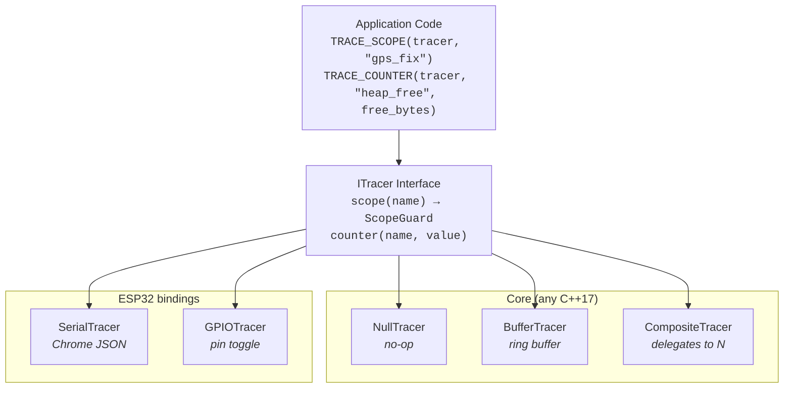

# embedded-tracer — Design

A lightweight, hierarchical scope-tracing library for embedded systems.
Designed for ESP32/FreeRTOS as a first target, with a platform-agnostic core
that compiles on any C++17 host.

## Motivation

### The problem

Firmware observability requires knowing *what the system is doing* at every
moment. Answering questions like "how much power does a GPS fix consume?" or
"which operation is responsible for the heap high-water mark?" requires two
things: a structured record of what operations ran and when, and the ability
to attribute resource measurements to those operations.

The traditional approach — ad-hoc `printf` and GPIO toggles — doesn't scale
to multi-threaded systems with nested operations spanning multiple subsystems.
Each new measurement need (power profiling, memory tracking, data usage
analysis) produces another bespoke instrumentation pass with no shared
structure.

### The solution

embedded-tracer provides a **scope tree** as the backbone of instrumentation.
Every significant operation is a named scope with RAII entry/exit tracking.
The scope tree is the single structure onto which multiple independent
**metric layers** (power, memory, timing, data usage) can be pinned — either
on-device or by external tools.

The scope tree answers *what is the system doing?* The metric layers answer
*what does it cost?* Keeping them separate means:
- The scope tree is always-on and near-zero cost (NullTracer in production)
- Metric layers are opt-in — enable power profiling on the bench, memory
  tracking when investigating a leak, data usage when optimizing cellular costs
- External measurement tools (PPK2 power profiler) align their data to the
  same scope boundaries without any firmware changes
- The same scopes serve multiple consumers: Perfetto visualization, PPK2
  channel encoding, on-device metric attribution, fleet-level analytics

### Why not use an existing tool?

We evaluated seven existing frameworks against the requirements of
resource-constrained embedded systems (ESP32 with ~300KB usable RAM):

| Tool | Assessment |
|------|-----------|
| **OpenTelemetry C++ SDK** | The span model (parent-child tree, attributes, linked metrics) is an exact match. But the SDK requires protobuf, gRPC/HTTP exporters, and heavy STL usage — ~100KB+ binary, far too large for a microcontroller. |
| **Perfetto native SDK** | Provides C++ RAII macros (`TRACE_EVENT`, `TRACE_COUNTER`) but targets Linux/Android/ChromeOS. Not ported to FreeRTOS/ESP-IDF. The *format* (Chrome JSON) is trivially easy to generate. |
| **barectf** | Generates pure ANSI C tracers from a YAML schema, ~1-3KB code. Excellent weight class but produces CTF (Common Trace Format) binary — flat events, no built-in parent-child hierarchy. Requires Babeltrace/Trace Compass for analysis, which is less ergonomic than Perfetto. |
| **Zephyr tracing / Zephelin** | Good reference architecture — ring buffer + post-hoc CTF-to-Chrome-JSON conversion. But it's Zephyr-specific (wrong RTOS) and kernel-focused (thread switches, mutex operations) rather than application-scoped. |
| **SEGGER SystemView** | Real-time FreeRTOS task/ISR tracing with a polished viewer. But the viewer is closed-source, events are flat (no hierarchical scopes), and there's no mechanism to import external data (like power measurements) for correlation. |
| **ESP-IDF app_trace** | JTAG-only high-speed trace to host. No scope concept, no hierarchy, not usable without a JTAG probe. The *APIs* it wraps (`esp_timer_get_time()`, heap hooks) are useful as metric sources within our scope tree. |
| **Tracy** | Feature-rich real-time profiler with RAII zones and memory tracking. Requires TCP streaming to a desktop viewer — impractical for battery-powered embedded devices. Significant binary size and RAM overhead. |

**Conclusion**: No existing tool provides hierarchical scoped tracing at
an appropriate weight class for embedded systems with Perfetto-compatible
output. The best approach is a custom library that combines:
- OpenTelemetry's **data model** (parent-child spans)
- barectf's **weight class** (~1-5KB code, no dynamic allocation in core)
- Perfetto's **output format** (Chrome JSON, directly visualizable)
- Zephyr tracing's **architecture** (ring buffer on device, conversion on host)

### Design influences

| Source | What we took |
|--------|-------------|
| **OpenTelemetry** | Span model — parent-child tree, attributes, linked metrics |
| **Perfetto** | Output format — Chrome Trace JSON, counter tracks, swim lanes per thread |
| **barectf** | Weight class — minimal generated code, small ring buffers, zero dynamic allocation |
| **Zephyr tracing / Zephelin** | Architecture — ring buffer on device, post-hoc conversion to Chrome JSON on host |

---

## Architecture



### Core (platform-agnostic)

Zero platform dependencies. Compiles on native host, ESP32, Zephyr,
bare-metal — anything with a C++17 compiler.

### ESP32 bindings

Depend on ESP-IDF (for `esp_timer_get_time()`, GPIO, FreeRTOS task ID).
Live in a separate source directory so the core compiles cleanly on native.

Future bindings (Zephyr, nRF, STM32) follow the same pattern — separate
source directory, same `ITracer` interface.

---

## Core API

### ITracer

```cpp
// embedded_tracer/i_tracer.h

class ITracer {
public:
    virtual ~ITracer() = default;

    /// Begin a named scope. Returns an RAII guard that ends the scope
    /// on destruction. Scopes nest — the current scope becomes the
    /// parent of any scope opened before this one closes.
    virtual ScopeGuard scope(const char* name) = 0;

    /// Record a counter value at the current timestamp. Counters are
    /// independent of scopes — they appear as time-series tracks in
    /// Perfetto alongside the scope swim lanes.
    virtual void counter(const char* name, int64_t value) = 0;
};
```

### ScopeGuard

```cpp
// embedded_tracer/scope_guard.h

class ScopeGuard {
public:
    /// Construct a scope guard. Records scope-enter.
    ScopeGuard(ITracer* tracer, const char* name, uint16_t scope_id);

    /// Destruct. Records scope-exit if tracer is non-null.
    ~ScopeGuard();

    // Move-only — scopes are not copyable.
    ScopeGuard(ScopeGuard&& o) noexcept;
    ScopeGuard& operator=(ScopeGuard&&) noexcept;
    ScopeGuard(const ScopeGuard&) = delete;
    ScopeGuard& operator=(const ScopeGuard&) = delete;

private:
    ITracer* tracer_;
    const char* name_;
    uint16_t scope_id_;
};
```

### Macros

```cpp
// embedded_tracer/trace_macros.h

#if EMBEDDED_TRACER_ENABLED
  #define TRACE_SCOPE(tracer, name) \
      auto _trace_scope_##__LINE__ = (tracer).scope(name)
  #define TRACE_COUNTER(tracer, name, val) \
      (tracer).counter(name, val)
#else
  #define TRACE_SCOPE(tracer, name) ((void)0)
  #define TRACE_COUNTER(tracer, name, val) ((void)0)
#endif
```

When `EMBEDDED_TRACER_ENABLED` is 0 or undefined, all tracing compiles to
nothing — zero code size, zero RAM, zero CPU.

---

## Tracer Implementations

### NullTracer

```cpp
// embedded_tracer/null_tracer.h

class NullTracer final : public ITracer {
public:
    static NullTracer& instance();

    ScopeGuard scope(const char* name) override {
        return ScopeGuard(nullptr, name, 0);  // no-op guard
    }

    void counter(const char*, int64_t) override {}
};
```

Production default. `ScopeGuard` with null tracer pointer — destructor is a
no-op branch. The compiler can often eliminate the guard entirely.

### BufferTracer

Platform-agnostic binary ring buffer tracer. The timestamp source is injected
so it works on any platform:

```cpp
// embedded_tracer/buffer_tracer.h

using TimestampFn = uint32_t (*)();

class BufferTracer final : public ITracer {
public:
    /// Construct with a caller-provided buffer and timestamp function.
    /// The buffer is NOT owned — caller manages its lifetime.
    BufferTracer(uint8_t* buffer, size_t size, TimestampFn timestamp_fn);

    ScopeGuard scope(const char* name) override;
    void counter(const char* name, int64_t value) override;

    /// Drain the buffer contents. Calls the visitor for each event.
    /// Emits the scope ID → name mapping table first, then events.
    void drain(EventVisitor& visitor);

    /// Number of events currently in the buffer.
    size_t event_count() const;

    /// True if events were lost due to buffer overflow.
    bool overflowed() const;

    /// Reset the buffer, discarding all events.
    void reset();
};
```

#### Binary event format

| Field | Size | Description |
|-------|------|-------------|
| `timestamp_us` | 4 bytes | From `TimestampFn`, truncated to uint32 (~71 min before wrap) |
| `scope_id` | 2 bytes | Auto-assigned ID for each unique scope name |
| `event_type` | 1 byte | 0=scope_enter, 1=scope_exit, 2=counter |
| `payload` | 0-8 bytes | Counter value (for type=2) |

~7-15 bytes per event. An 8KB buffer holds ~500-1000 events.

The scope ID → name mapping is maintained as a compact table (array of
`const char*` pointers). Scope names must be string literals (pointer
stability guaranteed). The mapping table is emitted at drain time so the
host can decode scope IDs back to names.

### SerialTracer (ESP32)

```cpp
// embedded_tracer_esp32/serial_tracer.h

class SerialTracer final : public ITracer {
public:
    /// Construct with a Print output (e.g. Serial).
    explicit SerialTracer(Print& output);

    ScopeGuard scope(const char* name) override;
    void counter(const char* name, int64_t value) override;
};
```

Emits one Chrome JSON event per line:

```json
{"ph":"B","ts":1234,"name":"gps_fix","pid":1,"tid":2}
{"ph":"E","ts":5678,"name":"gps_fix","pid":1,"tid":2}
{"ph":"C","ts":5678,"name":"heap","pid":1,"args":{"free":102400}}
```

- `ts` — microseconds from `esp_timer_get_time()`
- `pid` — process ID (1 by default, configurable for grouping)
- `tid` — FreeRTOS task handle cast to int (each task = swim lane in Perfetto)
- `ph:"B"` / `"E"` — scope begin/end
- `ph:"C"` — counter sample

Output is directly loadable in [Perfetto UI](https://ui.perfetto.dev) when
wrapped in `{"traceEvents":[...]}` by the host collector.

### GPIOTracer (ESP32)

```cpp
// embedded_tracer_esp32/gpio_tracer.h

struct GPIOScopeMapping {
    const char* name;   // scope name to match
    gpio_num_t pin;     // GPIO pin to toggle
};

class GPIOTracer final : public ITracer {
public:
    /// Construct with a mapping of scope names to GPIO pins.
    /// Pins are configured as outputs during construction.
    GPIOTracer(const GPIOScopeMapping* mappings, size_t count);

    ScopeGuard scope(const char* name) override;
    void counter(const char*, int64_t) override {}  // no-op for GPIO
};
```

Toggles mapped GPIO pins HIGH on scope enter, LOW on scope exit.
~1µs per event. Unmapped scopes are ignored (no GPIO overhead).

Designed for PPK2 digital inputs (D0-D7). The PPK2 records these as
logical channels alongside current measurements, providing sub-microsecond
alignment between scope boundaries and power data.

### CompositeTracer

```cpp
// embedded_tracer/composite_tracer.h

class CompositeTracer final : public ITracer {
public:
    /// Construct with up to N child tracers.
    CompositeTracer(std::initializer_list<ITracer*> tracers);

    ScopeGuard scope(const char* name) override;
    void counter(const char* name, int64_t value) override;
};
```

Delegates to all children. Typical use: `SerialTracer` for scope naming +
`GPIOTracer` for precise timing alignment with PPK2.

---

## Chrome Trace Format Reference

embedded-tracer targets the
[Chrome JSON Trace Format](https://docs.google.com/document/d/1CvAClvFfyA5R-PhYUmn5OOQtYMH4h6I0nSsKchNAySU/preview)
for output. This format is natively supported by
[Perfetto UI](https://ui.perfetto.dev) and `chrome://tracing`.

### Event types used

| `ph` | Type | Usage |
|------|------|-------|
| `B` | Begin | Scope enter — marks the start of a duration event |
| `E` | End | Scope exit — marks the end of a duration event |
| `C` | Counter | Counter sample — renders as a time-series graph track |
| `X` | Complete | Duration event with explicit `dur` field (used by BufferTracer drain, more compact than B+E) |
| `M` | Metadata | Process/thread naming (emitted once at trace start) |

### Example trace file

```json
{"traceEvents": [
  {"ph":"M","pid":1,"tid":1,"name":"process_name","args":{"name":"firmware"}},
  {"ph":"M","pid":1,"tid":1,"name":"thread_name","args":{"name":"main"}},
  {"ph":"M","pid":1,"tid":2,"name":"thread_name","args":{"name":"gps_task"}},
  {"ph":"B","ts":1000,"pid":1,"tid":1,"name":"wake_cycle"},
  {"ph":"B","ts":1100,"pid":1,"tid":1,"name":"init"},
  {"ph":"E","ts":1500,"pid":1,"tid":1,"name":"init"},
  {"ph":"B","ts":1600,"pid":1,"tid":2,"name":"gps_fix"},
  {"ph":"C","ts":1600,"pid":1,"tid":0,"name":"heap_free","args":{"value":142000}},
  {"ph":"E","ts":4200,"pid":1,"tid":2,"name":"gps_fix"},
  {"ph":"C","ts":4200,"pid":1,"tid":0,"name":"heap_free","args":{"value":138000}},
  {"ph":"E","ts":5000,"pid":1,"tid":1,"name":"wake_cycle"}
]}
```

Opens in Perfetto with:
- Two swim lanes (main task + gps_task)
- Nested scope bars (wake_cycle contains init, gps_fix runs on its own task)
- `heap_free` counter graph track below the swim lanes

---

## Serial Protocol

### Chrome JSON mode (SerialTracer)

One JSON object per line on serial output. The host collector
(embedded-host or any line-based serial reader) collects lines matching
`{"ph":...}` and wraps them:

```json
{"traceEvents": [<collected lines>]}
```

Lines not matching the JSON pattern are passed through as regular serial
output (log messages, test results, etc.). This means tracing and regular
`Serial.println()` coexist on the same port.

### Binary drain mode (BufferTracer)

When the host requests a buffer drain (via command protocol), the firmware
sends:

1. **Header** — magic bytes, event count, scope name table
2. **Events** — packed binary events (7-15 bytes each)
3. **Footer** — checksum

The host converts this to Chrome JSON. The binary protocol is defined in
`buffer_tracer.h` and documented separately once implemented.

### Event markers (PPK2 compatibility)

For backward compatibility with ppk2-python's existing `EventMapper`, the
SerialTracer can optionally emit PPK2-style event markers alongside Chrome
JSON:

```
T=0.001600 GPS_FIX_STARTED
{"ph":"B","ts":1600,"pid":1,"tid":2,"name":"gps_fix"}
T=0.004200 GPS_FIX_STOPPED
{"ph":"E","ts":4200,"pid":1,"tid":2,"name":"gps_fix"}
```

This allows the same serial output to feed both the Chrome Trace collector
and the PPK2 EventMapper channel encoding. Controlled by a configuration
flag at construction.

---

## Project Structure

```
embedded-tracer/
├── library.json                    # PlatformIO library metadata
├── platformio.ini                  # native + esp32s3 build/test environments
├── LICENSE
├── README.md
├── docs/
│   └── design.md                   # this file
├── src/
│   ├── embedded_tracer/            # core (platform-agnostic, C++17)
│   │   ├── i_tracer.h
│   │   ├── scope_guard.h
│   │   ├── scope_guard.cpp
│   │   ├── null_tracer.h
│   │   ├── buffer_tracer.h
│   │   ├── buffer_tracer.cpp
│   │   ├── composite_tracer.h
│   │   ├── composite_tracer.cpp
│   │   └── trace_macros.h
│   └── embedded_tracer_esp32/      # ESP32 bindings
│       ├── serial_tracer.h
│       ├── serial_tracer.cpp
│       ├── gpio_tracer.h
│       └── gpio_tracer.cpp
├── test/
│   ├── test_native/                # doctest, runs on host
│   │   ├── main.cpp                # doctest main
│   │   ├── test_scope_guard.cpp
│   │   ├── test_buffer_tracer.cpp
│   │   ├── test_composite_tracer.cpp
│   │   └── test_chrome_json.cpp    # validate JSON output format
│   └── test_esp32s3/               # doctest, runs on hardware
│       ├── main.cpp
│       ├── test_serial_tracer.cpp
│       └── test_gpio_tracer.cpp
└── examples/
    ├── basic_scopes/               # minimal: scope nesting, print to serial
    │   └── main.cpp
    └── esp32_perfetto/             # full: ESP32 → serial → Perfetto
        └── main.cpp
```

### PlatformIO environments

| Environment | Platform | What it builds/tests |
|------------|----------|---------------------|
| `native` | Host (macOS/Linux) | Core library + native doctests |
| `esp32s3` | ESP32-S3 | Full library (core + ESP32 bindings) + embedded doctests |

### library.json

```json
{
    "name": "embedded-tracer",
    "version": "0.1.0",
    "description": "Lightweight hierarchical scope tracing for embedded systems with Perfetto output",
    "keywords": ["tracer", "profiling", "perfetto", "instrumentation", "embedded", "esp32"],
    "platforms": ["native", "espressif32"],
    "frameworks": ["arduino", "espidf"],
    "build": {
        "srcFilter": [
            "+<embedded_tracer/>",
            "+<embedded_tracer_esp32/>"
        ]
    }
}
```

The `srcFilter` for native builds excludes `embedded_tracer_esp32/` via
the platformio.ini environment config, so the core compiles without ESP-IDF.

---

## Usage Example

### Basic (any platform)

```cpp
#include <embedded_tracer/null_tracer.h>
#include <embedded_tracer/trace_macros.h>

void do_work(ITracer& tracer) {
    TRACE_SCOPE(tracer, "work");

    {
        TRACE_SCOPE(tracer, "phase_1");
        // ... phase 1 ...
    }

    {
        TRACE_SCOPE(tracer, "phase_2");
        // ... phase 2 ...
        TRACE_COUNTER(tracer, "items_processed", 42);
    }
}

// Production: zero overhead
NullTracer tracer;
do_work(tracer);
```

### ESP32 with Perfetto output

```cpp
#include <embedded_tracer_esp32/serial_tracer.h>
#include <embedded_tracer_esp32/gpio_tracer.h>
#include <embedded_tracer/composite_tracer.h>
#include <embedded_tracer/trace_macros.h>

// Serial for naming, GPIO for PPK2 alignment
SerialTracer serial_tracer(Serial);
GPIOScopeMapping gpio_map[] = {
    {"gps_fix", GPIO_NUM_4},
    {"radio_tx", GPIO_NUM_5},
};
GPIOTracer gpio_tracer(gpio_map, 2);
CompositeTracer tracer({&serial_tracer, &gpio_tracer});

void app_main() {
    TRACE_SCOPE(tracer, "boot");

    {
        TRACE_SCOPE(tracer, "gps_fix");
        // GPIO 4 goes HIGH, serial emits {"ph":"B",...,"name":"gps_fix"}
        gps_acquire_fix();
        // GPIO 4 goes LOW, serial emits {"ph":"E",...,"name":"gps_fix"}
    }

    TRACE_COUNTER(tracer, "heap_free", esp_get_free_heap_size());
}
```

Collect serial output, wrap in `{"traceEvents":[...]}`, open in
[ui.perfetto.dev](https://ui.perfetto.dev).

### Injecting into services

```cpp
class SensorService {
    ITracer& tracer_;
public:
    SensorService(ITracer& tracer = NullTracer::instance())
        : tracer_(tracer) {}

    void read() {
        TRACE_SCOPE(tracer_, "sensor_read");
        // ... read hardware ...
    }
};

// Test: verify scopes are emitted
BufferTracer test_tracer(buf, sizeof(buf), mock_timestamp);
SensorService service(test_tracer);
service.read();
CHECK(test_tracer.event_count() == 2);  // enter + exit
```

---

## Future: Cross-Thread Causal Profiling

The current scope model is single-threaded: a scope opens and closes on the
same thread, and nesting is implicit via the call stack. This works well for
power profiling (which peripheral is active?) and simple timing (how long did
this operation take?).

However, real firmware has **shared service threads** (e.g. notecardIO queue,
SPI bus manager) that serve requests from multiple concurrent actions. Profiling
these requires two views:

- **Vertical (action-centric):** "What did `sync_gps_fix` cost end-to-end?"
  Follow the causal chain from trigger to completion, across thread boundaries.
  Include the slice of notecardIO time, memory, and data used to fulfill this
  specific action.

- **Horizontal (service-centric):** "What did notecardIO do in total?" All
  requests served, queue depth, throughput, latency distribution. Independent
  of which action triggered each request.

### Primitives

Three concepts compose to support both views:

| Concept | What it is | Chrome Trace equivalent |
|---------|-----------|----------------------|
| **Scope** | A START/STOP pair on a single thread (existing) | `ph:"B"` / `ph:"E"` with `tid` |
| **Flow** | A causal link across thread/scope boundaries | `ph:"s"` / `ph:"f"` with shared `id` |
| **Resource** | A measurable dimension (time, current, memory, bytes) | Counter tracks, external data |

The only new primitive needed is **Flow**. Everything else (scopes, resources,
aggregation) composes on top.

### Example: action enqueues work on a service thread

```
// Action thread (tid=2): GPS sync
TRACE_SCOPE(tracer, "gps_sync")
  TRACE_FLOW_START(tracer, "notecard_req", flow_id=42)   // enqueue
  // ... blocks or continues ...
  TRACE_FLOW_END(tracer, "notecard_req", flow_id=42)     // response received

// Service thread (tid=1): notecardIO processes request
TRACE_FLOW_STEP(tracer, "notecard_req", flow_id=42)      // dequeue
TRACE_SCOPE(tracer, "notecard_transaction")
  // ... J-request, wait for response ...
```

### Serial protocol extension

```
T=1.000 GPS_SYNC_STARTED          tid=2
T=1.001 NOTECARD_REQ_STARTED      tid=2  flow_id=42
T=1.050 NOTECARD_REQ_STARTED      tid=1  flow_id=42
T=1.200 NOTECARD_REQ_STOPPED      tid=1
T=1.210 GPS_SYNC_STOPPED          tid=2
```

Chrome JSON already supports flow events natively:
```json
{"ph":"s","ts":1001,"name":"notecard_req","id":42,"pid":1,"tid":2}
{"ph":"f","ts":1050,"name":"notecard_req","id":42,"pid":1,"tid":1}
```

### Host-side analysis

The host (embedded-bridge) would extend EventCapture with a `Flow` type:

- **Vertical analysis:** Given a top-level scope, traverse its flow edges to
  find all service-thread scopes that were causally linked. Sum resources
  (time, current, memory) across the full causal tree.

- **Horizontal analysis:** Ignore flow edges. Aggregate all scopes on a
  service thread to get total service cost, throughput, and utilization.

### Implementation notes

- Flow IDs can be simple incrementing counters (uint16 wrapping is fine —
  flows are short-lived relative to the counter space).
- The `ITracer` interface would gain `flow_start(name, id)`,
  `flow_step(name, id)`, `flow_end(name, id)`.
- NullTracer's flow methods are no-ops. BufferTracer stores flow events in
  the ring buffer (same 7-byte format, new event_type values).
- This is **not needed for Phase 1 power profiling** — peripheral-level
  START/STOP is sufficient. Flow events become important when profiling
  multi-threaded application logic (e.g. "what's the total cost of a
  Notehub sync cycle?").

---

## Memory & Code Budget

| Component | Code size | RAM (when active) | RAM (NullTracer) |
|-----------|-----------|-------------------|------------------|
| ITracer + ScopeGuard | ~1KB | 0 | 0 |
| NullTracer | ~0 (inlined) | 0 | 0 |
| SerialTracer | ~2KB | ~256B write buffer | N/A |
| GPIOTracer | ~0.5KB | ~4B pin state | N/A |
| BufferTracer | ~1KB | 8-32KB ring buffer | N/A |
| CompositeTracer | ~0.5KB | ~16B (pointer array) | N/A |
| **Total (production)** | **~1KB** | **0** | **0** |
| **Total (full profiling)** | **~5KB** | **~1-2KB + ring buffer** | — |

Ring buffer for BufferTracer is caller-provided — can be in PSRAM on ESP32
for larger captures without consuming main RAM.
